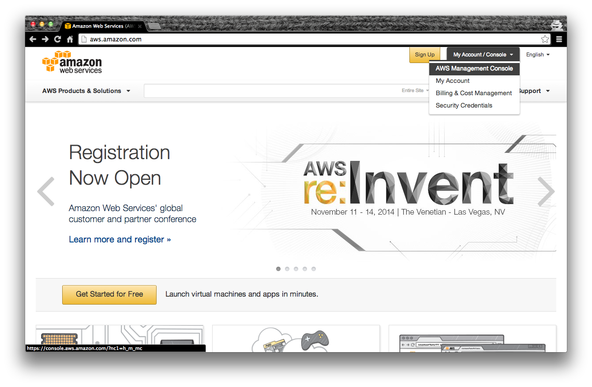
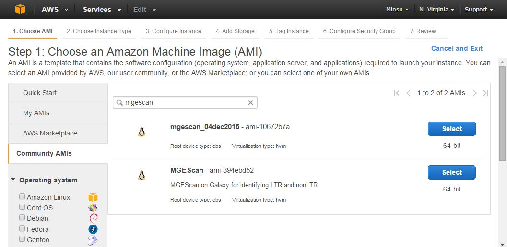
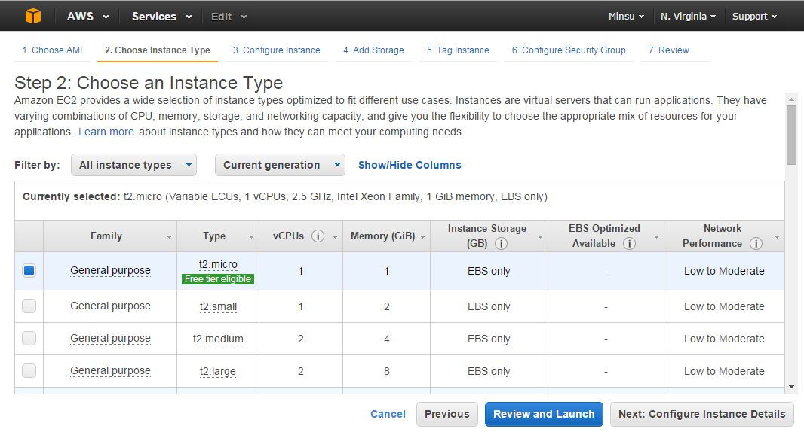
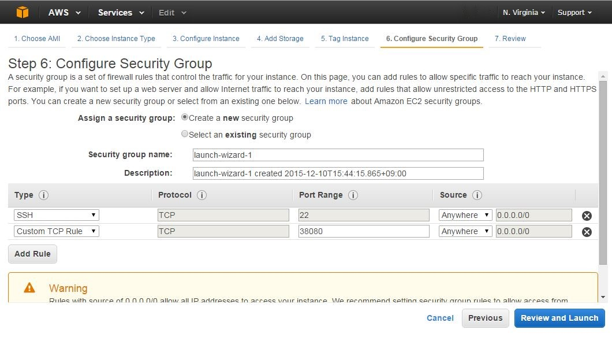
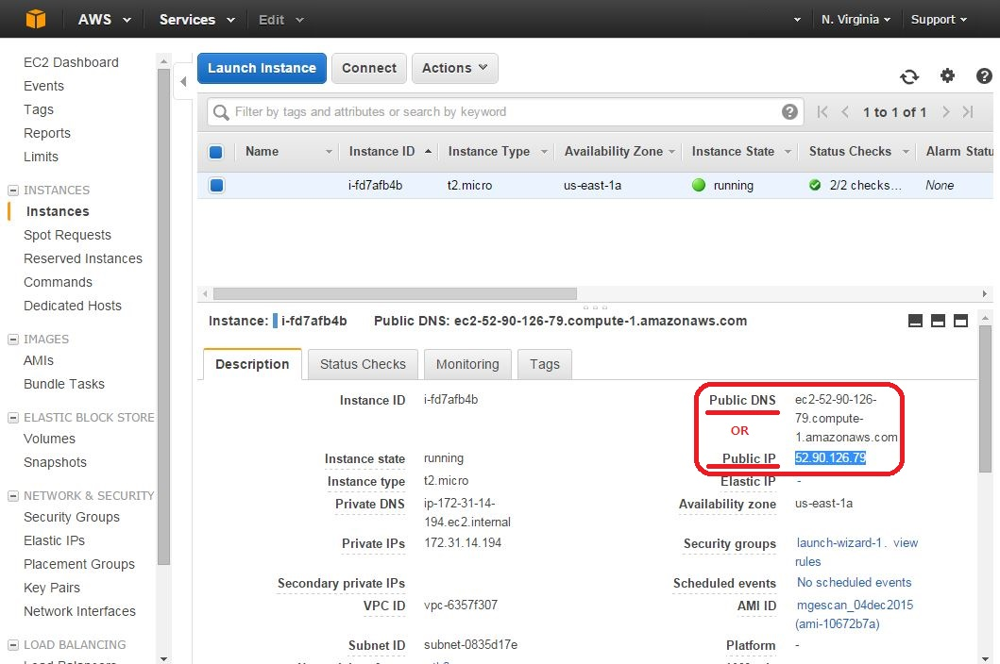
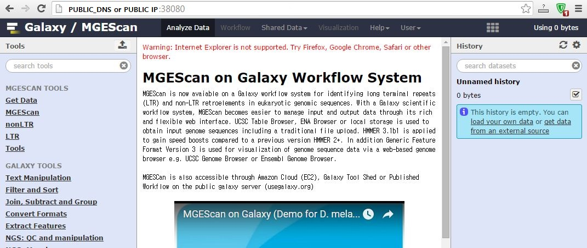
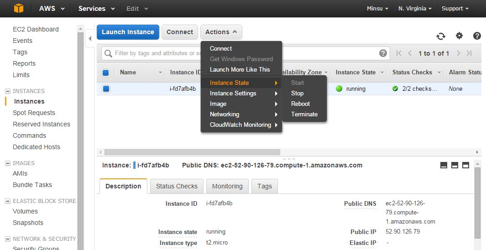

.. _ref-mgescan-ec2:

MGEScan on Amazon Cloud (EC2)
===============================================================================

With Amazon Cloud Web Services, a virtual single or distributed system for
MGEScan can be easily deployed. MGEScan (Amazon machine image ID: ami-10672b7a 
on 'US East-Ohio' region)
is available to create our Galaxy-based system for MGEScan which is identifying
long terminal repeats (LTR) and non-LTR retroelements in eukaryotic genomic
sequences. More cloud options will be available soon including Google Compute
Engine, Microsoft Windows Azure or private cloudplatforms such as OpenStack and
Eucalyptus.

.. note:: ami-10672b7a was created in 2015. To apply new updates of MGEScan and Galaxy, follow the instructions below after launching the image on AWS EC2.
* Stop Galaxy server first - processs looks like `python ./scripts/paster.py serve universe_wsgi.ini`
* Update system packages ``sudo yum update -y``
* Update mgescan code ``cd $MGESCAN_SRC;git pull;python setup.py install``
* Update Galaxy code ``cd $GALAXY_HOME;git pull``
* Migrate Galaxy DB, if necessary ``cd $GALAXY_HOME;./run.sh;sh manage_db.sh -c ./universe_wsgi.ini upgrade``
* Update Galaxy tools ``cp -pr $MGESCAN_SRC/galaxy-modified/* $GALAXY_HOME``
* Start Galaxy server ``cd $GALAXY_HOME;nohup bash run.sh &``

Command lines only

::

         kill `ps -ef|grep universe_wsgi|grep -v grep|awk '{print $2}'`
         sudo yum update -y
         cd $MGESCAN_SRC;git pull;python setup.py install
         cd $GALAXY_HOME;git pull
         cd $GALAXY_HOME;./run.sh;sh manage_db.sh -c ./universe_wsgi.ini upgrade
         cp -pr $MGESCAN_SRC/galaxy-modified/* $GALAXY_HOME
         cd $GALAXY_HOME;nohup bash run.sh &

Deploying MGEScan on Galaxy
-------------------------------------------------------------------------------

First step is getting an Amazon account to launch virtual instances on Amazon
IaaS platform EC2.

AWS EC2 Account
^^^^^^^^^^^^^^^^^^^^^^^^^^^^^^^^^^^^^^^^^^^^^^^^^^^^^^^^^^^^^^^^^^^^^^^^^^^^^^^

If you already have an account of Amazon AWS EC2, open AWS Management Console
to launch our MGEScan image on EC2. Otherwise, create an AWS Account.

* http://aws.amazon.com

MGEScan Machine Image
^^^^^^^^^^^^^^^^^^^^^^^^^^^^^^^^^^^^^^^^^^^^^^^^^^^^^^^^^^^^^^^^^^^^^^^^^^^^^^^

In AWS Management Console, open *EC2 Dashboard > Launch Instance*. To choose an
Amazon Machine Image (AMI) of MGEScan, select *Community AMIs* on the left tab,
and search by name or id, e.g. mgescan or ami-10672b7a. (US East-Ohio Region Only)

MGEScan EC2 Image Information
"""""""""""""""""""""""""""""""""""""""""""""""""""""""""""""""""""""""""""""""

* Region: US East
* Image Name: MGEScan
* ID: ami-10672b7a
* Server type: 64bit
* Description: MGEscan on Galaxy for identifying LTR and nonLTR
* Root device type: ebs 
* Virtualization type: hvm

Choose an Instance Type for ``MGEScan`` Instance
^^^^^^^^^^^^^^^^^^^^^^^^^^^^^^^^^^^^^^^^^^^^^^^^^^^^^^^^^^^^^^^^^^^^^^^^^^^^^^^

Once you choose **MGEScan** image as a  base image, you need to select the size
of instance. ``t2.micro`` uses 1 vCPUs and 1 GB memory which is in free tier.
Ohter options are available to have large instance e.g. 40 vCPUs. Click
**Review and Launch** icon at bottom of the page.

.. tip:: t2.micro: (Variable ECUs, 1 vCPUs, 2.5 GHz, Intel Xeon Family, 1 GiB
         memory, EBS only)

Security Group for Web
^^^^^^^^^^^^^^^^^^^^^^^^^^^^^^^^^^^^^^^^^^^^^^^^^^^^^^^^^^^^^^^^^^^^^^^^^^^^^^^

MGEscan / Galaxy uses ``38080`` default web port. We need to add a rule to have
this port opened on the new instance. 

There are a few steps you have to follow.

* Find "Security Groups" section and click "Edit security groups". "Create a new
security group" is selected as a default with a 22 SSH port opened to anywhere.

* We will add ``38080`` tcp port. Click "Add Rule" and type ``38080`` in the
  "Port Range" input box.

* Don't forget to update "Source" to **"Anywhere"** from "Custom IP".

* Once you're done, click "Reivew and Launch".

* Click "Launch" again.

* Choose a SSH keypair from existing or new one.

* Click "Launch Instance" and wait.

* Find out public IP address and open a web browser with the address. e.g.
  http://[IP address]:38080
  *Don't forget the port number 38080*

Access to MGEScan Instance
^^^^^^^^^^^^^^^^^^^^^^^^^^^^^^^^^^^^^^^^^^^^^^^^^^^^^^^^^^^^^^^^^^^^^^^^^^^^^^^

Once the MGEScan instance is launched and accessible, galaxy scientific
workflow system for MGEScan and SSH connection are avabilable through given dns
name.

Ready To Use
^^^^^^^^^^^^^^^^^^^^^^^^^^^^^^^^^^^^^^^^^^^^^^^^^^^^^^^^^^^^^^^^^^^^^^^^^^^^^^^

The MGEScan is now ready to conduct your experiment on Amazon EC2.

.. Note:: Do not forget to terminate your virtual instance after all analysis
   completed. Amazon Cloud charges use of VM instances hourly.

Terminating AWS Instance:

Note
-------------------------------------------------------------------------------

Add a script to auto-start Galaxy after reboot in ``/etc/rc.local``

::

   su ec2-user -c 'source ~/.mgescanrc;cd $GALAXY_HOME;nohup sh run.sh &'
