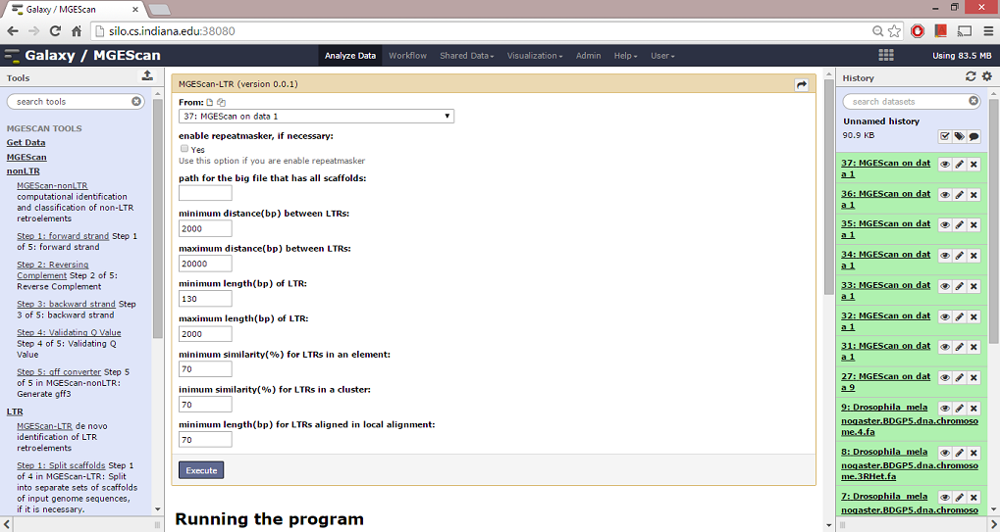

MGEScan-LTR
===========

MGEScan-LTR program identifies long terminal repeats (LTR). RepeatMasker can be used to identify repetitive elements in genomic sequences.

Description
-----------

.. comment::

        As a common class of transposable elements, long terminal repeat (LTR) retroelements play important roles in shaping the structures of their host genomes. The identification and genome-wide comparative analysis of LTR retroelements from multiple genomes are useful for a better understanding of the genome evolution. 
        We conducted a comprehensive de novo identification of LTR retroelements in the recently completed genome of Daphnia pulex, an aquatic microcrustacean. For the purpose of comparison, we conducted similar analyses on the completed genomes of four other invertebrate genomes, one fish genome, and one plant genome. In total, we identified 333 intact LTR retroelements in the D. pulex genome, which were categorized into 141 families. Nearly half of the identified intact elements were in the gypsy group. A large number of intact retroelements were also found in the copia (95), BEL/Pao (66) and DIRS (19) group. Polymorphism among mutation-accumulation lines indicates that some retroelements identified (two copia and two DIRS LTR retroelements) are dynamic in the genome of D. pulex. The sequences of these potentially active LTR retroelements have been deposited into Genbank [GenBank: EU528614-7]. The phylogenetic analysis of the representative reverse transcriptase sequences from all seven genomes showed that the retroelements in the D. pulex genome form distinct families of BEL/Pao, copia, gypsy and DIRS relative to those from other genomes examined, suggesting that a majority of the LTR retroelements in the D. pulex genome are novel. 
        The comprehensive phylogenetic analysis of newly identified LTR retroelements in the Daphnia genome reveals divergent lineages. In addition, transposon display experiments show that some of these retroelements may be active in current populations of D. pulex.

MGEScan-LTR identifies all types of LTR retrotransposons, i.e., young intact, old intact, and solo LTR retrotransposons, without relying on a library of known elements. It uses approximate string matching, protein domain analysis, and profile Hidden Markov Models to identify intact LTR retrotransposons. 

For details, please read following references.

* Rho, M., et al. (2007) De novo identification of LTR retrotransposons in eukaryotic genomes. BMC Genomics, 8, 90.
* Rho, M., et al. (2010) LTR retroelements in the genome of Daphnia pulex. BMC Genomics, 11, 425.

Running the program
-------------------
To run MGEScan-LTR, follow the steps below,

* Specify options that you like to have:

  * Check repeatmasker if you want to preprocess
  * Check scaffold if the input file has all scaffolds.
* Update values:

  * min_dist: minimum distance(bp) between LTRs.
  * max_dist: maximum distance(bp) between LTRS
  * min_len_ltr: minimum length(bp) of LTR.
  * max_len_ltr: maximum length(bp) of LTR.
  * ltr_sim_condition: minimum similarity(%) for LTRs in an element.
  * cluster_sim_condition: minimum similarity(%) for LTRs in a cluster
  * len_condition: minimum length(bp) for LTRs aligned in local alignment.
* Click 'Execute'

Options
--------

* RepeatMasker: Yes / No
* file path for multiple sequences to divide
* settings for LTRs

  - minimum distance(bp) between LTRs
  - maximum distance(bp) between LTRs
  - minimum length(bp) of LTR
  - maximum length(bp) of LTR
  - minimum similarity(%) for LTRs in an element
  - minimum similarity(%) for LTRs in a cluster
  - minimum length(bp) for LTRs aligned in local alignment

Results
-------
Upon completion, MGEScan-LTR generates a file ltr.out. This output file has information about clusters and coordinates of LTR retrotransposons identified. Each cluster of LTR retrotransposons starts with the head line of [cluster_number]---------, followed by the information of LTR retrotransposons in the cluster. The columns for LTR retrotransposons are as follows.

* LTR_id: unique id of LTRs identified. It consist of two components, sequence file name and id in the file. For example, chr1_2 is the second LTR retrotransposon in the chr1 file.
* start position of 5 LTR.
* end position of 5 LTR.
* start position of 3 LTR.
* end position of 3 LTR.
* strand: + or -.
* length of 5 LTR.
* length of 3 LTR.
* length of the LTR retrotransposon.
* TSD on the left side of the LTR retotransposons.
* TSD on the right side of the LTR retrotransposons.
* di(tri)nucleotide on the left side of 5LTR
* di(tri)nucleotide on the right side of 5LTR
* di(tri)nucleotide on the left side of 3LTR
* di(tri)nucleotide on the right side of 3LTR

License
-------
Copyright 2015. You may redistribute this software under the terms of the GNU General Public License.
