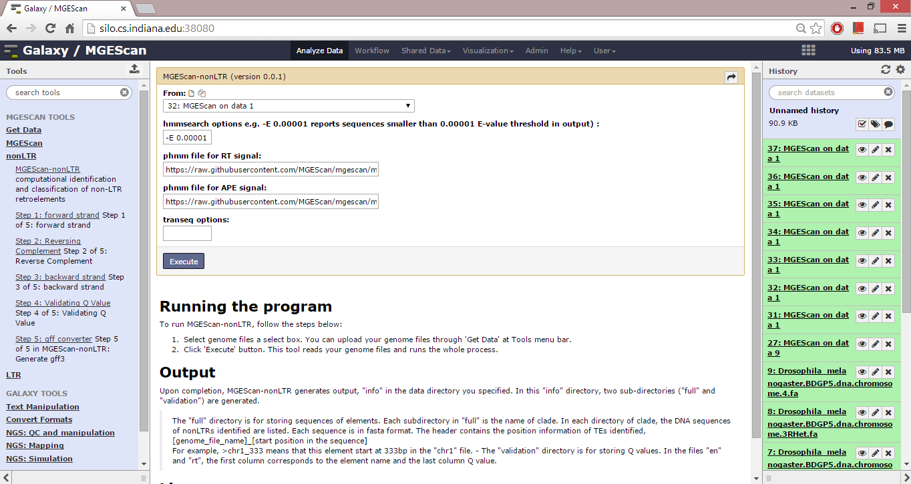

MGEScan-nonLTR
===============================================================================

MGEScan-nonLTR is a program to identify non-long terminal repeat (non-LTR)
retrotransposons in genomic sequences. A few options are available in the
Galaxy workflow system to configure the program settings, e.g. hmmsearch of
protein sequence database with a profile hidden Markov model (HMM). 

Description
-------------------------------------------------------------------------------

.. comment::

        Non-long terminal repeat (non-LTR) retrotransposons are a class of
        mobile genetic elements (MGEs) that have been found in most eukaryotic
        genomes, sometimes in extremely high numbers. Computational methods for
        genome-wide identification of MGEs have become increasingly necessary
        for both genome annotation and evolutionary studies. We developed an
        computational approach to the identification of non-LTR
        retrotransposons in genomic sequences, based on a generalized hidden
        Markov model (GHMM), in which the hidden states represent the protein
        domains and linker regions encoded in the non-LTR retrotransposons, and
        their emission probabilities are modeled by profile hidden Markov
        models (for protein domains) and Gaussian Bayes classifiers (for linker
        regions), respectively. In order to classify the non-LTR
        retrotransposons into one of the twelve previously characterized clades
        using the same model, we defined separate hidden states for different
        clades. Our method was tested on the genome sequences of four
        eukaryotic organisms, Drosophila melanogaster, Daphnia pulex, Ciona
        intestinalis, and Strongylocentrotus purpuratus. For the D.
        melanogaster genome, our method found all known full-length elements
        and simultaneously classified them into the clades, CR1, I, Jockey,
        LOA, and R1. Notably, for the D. pulex genome, in which no non-LTR
        retrotransposon has been annotated, our method found a significantly
        larger number of elements, compared with the results of RepeatMasker
        using the current version of the RepBase Update (RU) library. We also
        identified novel elements in the other two genomes, which has been
        partially studied for non-LTR retrotransposons.

MGEScan-nonLTR identifies non-LTR retrotransposons based on Gaussian Bayes
classifiers and generalized hidden Markov models consisting of twelve super
states that correspond to different clades or closely related clades.

For details, please read following reference.

* Rho, M., Tang, H. (2009) MGEScan-non-LTR: computational identification and
  classification of autonomous non-LTR retrotransposons in eukaryotic genomes.
  Nucleic Acids Research, 37(21), e143.

Running the program
-------------------------------------------------------------------------------

To run MGEScan-nonLTR, follow the steps below:

* Select genome files a select box. You can upload your genome files through
  'Get Data' at Tools menu bar.
* Click 'Execute' button. This tool reads your genome files and runs the whole
  process.

Options
-------------------------------------------------------------------------------

* hmmmsearch options 
  e.g. -E 0.00001 : reports sequences smaller than 0.00001 E-value threshold in
  output
* URL of the profile files for RT and APE 
* EMBOSS transeq options

Results
-------------------------------------------------------------------------------

Upon completion, MGEScan-nonLTR generates output, "info" in the data directory
you specified. In this "info" directory, two sub-directories ("full" and
"validation") are generated.

The "full" directory is for storing sequences of elements. Each subdirectory in
"full" is the name of clade. In each directory of clade, the DNA sequences of
nonLTRs identified are listed. Each sequence is in fasta format. The header
contains the position information of TEs identified, [genome_file_name]_[start
position in the sequence] For example, >chr1_333 means that this element start
at 333bp in the "chr1" file. - The "validation" directory is for storing Q
values. In the files "en" and "rt", the first column corresponds to the element
name and the last column Q value.

License
-------------------------------------------------------------------------------

Copyright 2015. You may redistribute this software under the terms of the GNU
General Public License.

