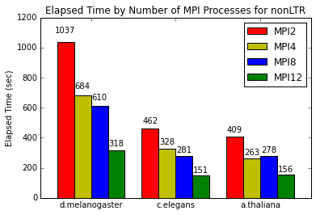
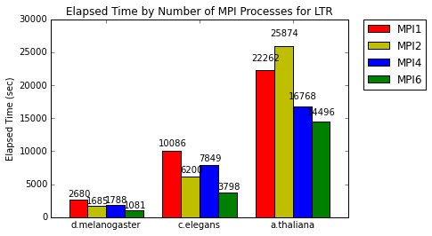

Test Results (New)
===============================================================================

.. sidebar:: Page Contents

   .. contents::
         :local:
 
Three genomes were tested with MGEScan-LTR and MGEScan-nonLTR programs.

* Test genome sequences:
   - D. melanogaster (dm3): `fruitfly.org <ftp://ftp.fruitfly.org/pub/download/compressed/na_whole-genome_genomic_dmel_RELEASE3.FASTA.gz>`_
   - C. elegans: `wormbase.org <ftp://ftp.wormbase.org/pub/wormbase/species/c_elegans/sequence/genomic/c_elegans.PRJNA13758.WS251.genomic.fa.gz>`_
   - A. thaliana: `nih.gov <ftp://ftp.ncbi.nlm.nih.gov/genomes/all/GCF_000001735.3_TAIR10/GCF_000001735.3_TAIR10_genomic.fna.gz>`_
* Test Environment: 
   chameleoncloud.org
* Hardware Spec: 
   - Intel Xeon E5-2670 v3 “Haswell” processors (each with 12 cores @ 2.3GHz)
   - 48 vCPUs
   - 128 GiB 
* Operating System:
   - Ubuntu 14.04 LTS

**Performance nonLTR with MPI**

**Performance LTR with MPI**

`ipynb file <https://github.com/MGEScan/evaluation/blob/master/results/mgescan.ipynb>`_

D. melanogaster (dm3)
-------------------------------------------------------------------------------

* results (gff3): https://github.com/MGEScan/evaluation/tree/accuracy-evaluation/results/dm3

Evaluation
^^^^^^^^^^^^^^^^^^^^^^^^^^^^^^^^^^^^^^^^^^^^^^^^^^^^^^^^^^^^^^^^^^^^^^^^^^^^^^^

.. list-table:: Elapsed time for MGEScan-nonLTR (dm3)
   :header-rows: 1

   * - Elapsed Time
     - Options
   * - 5 mins (318 secs)
     - 12 MPI Processes
   * - 11 mins (610 secs)
     - 8 MPI Processes
   * - 12 mins (684 secs)
     - 4 MPI Processes
   * - 18 mins (1037 secs)
     - 2 MPI Processes

.. list-table:: Elapsed time for MGEScan-LTR (dm3)
   :header-rows: 1

   * - Elapsed Time
     - Options
   * - 18 mins (1081 secs)
     - 6 MPI Processes
   * - 30 mins (1788 secs)
     - 4 MPI Processes
   * - 28 mins (1685 secs)
     - 2 MPI Processes
   * - 45 mins (2680 secs)
     - 1 MPI Process

C. elegans
-------------------------------------------------------------------------------

* results (gff3): https://github.com/MGEScan/evaluation/tree/accuracy-evaluation/results/c_elegans

A. thaliana
-------------------------------------------------------------------------------

* results (gff3): https://github.com/MGEScan/evaluation/tree/accuracy-evaluation/results/a_thaliana
