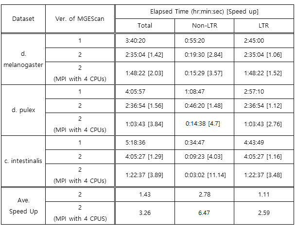

Test Results
===============================================================================

.. sidebar:: Page Contents

   .. contents::
         :local:

Four sample genomes were tested with MGEScan-LTR and MGEScan-nonLTR programs.

* Test genome sequences:
   - D. melanogaster (dm3): `ucsc <http://hgdownload.soe.ucsc.edu/goldenPath/dm3/bigZips/chromFa.tar.gz>`_
   - C. intestinalis (KH): `Ensembl <ftp://ftp.ensembl.org/pub/release-82/fasta/ciona_intestinalis/dna/Ciona_intestinalis.KH.dna.toplevel.fa.gz>`_   
..   - C. intestinalis (ci2): `ucsc <http://hgdownload.soe.ucsc.edu/goldenPath/ci2/bigZips/ScaffoldFa.zip>`_
   - D. pulex (GCA_000187875.1): `Ensembl Genomes <ftp://ftp.ensemblgenomes.org/pub/metazoa/release-28/fasta/daphnia_pulex/dna/Daphnia_pulex.GCA_000187875.1.28.dna.genome.fa.gz>`_
* Test Environment: 
   Cloud instances of FutureSystems at Indiana University (http://futuresystems.org). 
* Hardware Spec: 
   - Intel Xeon X5550 2.66GHz
   - 8 vCPUs
   - 16 GB DDR3 1333 MHz
   - 160GB 7200RPM SATA
* Operating System:
   - Ubuntu 14.04 LTS

.. Table 1. Experimental results on throughput improvement
**Test Genome Sequences**

D. melanogaster (dm3)
-------------------------------------------------------------------------------

* :download:`dm3.gff3 <sample/dm3.gff3.txt>`
* :download:`dm3.ltr.out <sample/dm3.ltr.out.txt>`
* :download:`dm3.en <sample/dm3.en.txt>`
* :download:`dm3.rt <sample/dm3.rt.txt>`

Evaluation
^^^^^^^^^^^^^^^^^^^^^^^^^^^^^^^^^^^^^^^^^^^^^^^^^^^^^^^^^^^^^^^^^^^^^^^^^^^^^^^

.. list-table:: Elapsed time for MGEScan (dm3)
   :header-rows: 1

   * - Program
     - Total
     - nonLTR
     - LTR
     - Options
   * - MGEScan1.3.1
     - 3 hrs 40 mins (13,220 secs)
     - 55 mins (3,320 secs)
     - 2 hrs 45 mins  (9,900 secs)
     - HMMER2, no MPI
   * - MGEScan2
     - 2 hrs 35 mins (9,304 secs)
     - 19 mins (1,170 secs)
     - 2 hrs 35 mins (9,304 secs)
     - HMMER3.1b1, no MPI
   * - MGEScan2 with MPI
     - 1 hr 48 mins (6,502 secs)
     - 15 mins (929 secs)
     - 1 hr 48 mins (6,502 secs)
     - HMMER3.1b1, MPI with 4 processors

Extra Files
^^^^^^^^^^^^^^^^^^^^^^^^^^^^^^^^^^^^^^^^^^^^^^^^^^^^^^^^^^^^^^^^^^^^^^^^^^^^^^^

* :download:`dm3.tar.gz <sample/dm3.tar.gz>` (Compressed file)

.. comment::

        * :download:`en <sample/dm3/data/info/validation/en.txt>`
        * :download:`rt <sample/dm3/data/info/validation/rt.txt>`
        * :download:`R2.rt.pep <sample/dm3/data/info/full/R2/R2.rt.pep.txt>`
        * :download:`R2.rt.dna <sample/dm3/data/info/full/R2/R2.rt.dna.txt>`
        * :download:`R2.dna <sample/dm3/data/info/full/R2/R2.dna.txt>`
        * :download:`R2.pep <sample/dm3/data/info/full/R2/R2.pep.txt>`
        * :download:`I.en.dna <sample/dm3/data/info/full/I/I.en.dna.txt>`
        * :download:`I.rt.dna <sample/dm3/data/info/full/I/I.rt.dna.txt>`
        * :download:`I.en.pep <sample/dm3/data/info/full/I/I.en.pep.txt>`
        * :download:`I.pep <sample/dm3/data/info/full/I/I.pep.txt>`
        * :download:`I.dna <sample/dm3/data/info/full/I/I.dna.txt>`
        * :download:`I.rt.pep <sample/dm3/data/info/full/I/I.rt.pep.txt>`
        * :download:`Jockey.en.dna <sample/dm3/data/info/full/Jockey/Jockey.en.dna.txt>`
        * :download:`Jockey.rt.pep <sample/dm3/data/info/full/Jockey/Jockey.rt.pep.txt>`
        * :download:`Jockey.dna <sample/dm3/data/info/full/Jockey/Jockey.dna.txt>`
        * :download:`Jockey.en.pep <sample/dm3/data/info/full/Jockey/Jockey.en.pep.txt>`
        * :download:`Jockey.rt.dna <sample/dm3/data/info/full/Jockey/Jockey.rt.dna.txt>`
        * :download:`Jockey.pep <sample/dm3/data/info/full/Jockey/Jockey.pep.txt>`
        * :download:`R1.dna <sample/dm3/data/info/full/R1/R1.dna.txt>`
        * :download:`R1.en.pep <sample/dm3/data/info/full/R1/R1.en.pep.txt>`
        * :download:`R1.pep <sample/dm3/data/info/full/R1/R1.pep.txt>`
        * :download:`R1.en.dna <sample/dm3/data/info/full/R1/R1.en.dna.txt>`
        * :download:`R1.rt.dna <sample/dm3/data/info/full/R1/R1.rt.dna.txt>`
        * :download:`R1.rt.pep <sample/dm3/data/info/full/R1/R1.rt.pep.txt>`
        * :download:`CR1.en.dna <sample/dm3/data/info/full/CR1/CR1.en.dna.txt>`
        * :download:`CR1.dna <sample/dm3/data/info/full/CR1/CR1.dna.txt>`
        * :download:`CR1.pep <sample/dm3/data/info/full/CR1/CR1.pep.txt>`
        * :download:`CR1.rt.pep <sample/dm3/data/info/full/CR1/CR1.rt.pep.txt>`
        * :download:`CR1.rt.dna <sample/dm3/data/info/full/CR1/CR1.rt.dna.txt>`
        * :download:`CR1.en.pep <sample/dm3/data/info/full/CR1/CR1.en.pep.txt>`
        * :download:`nonltr.gff3 <sample/dm3/data/info/nonltr.gff3.txt>`

C. intestinalis (KH)
-------------------------------------------------------------------------------

* :download:`KH.gff3 <sample/KH.gff3.txt>`
* :download:`KH.ltr.out <sample/KH.ltr.out.txt>`
* :download:`KH.en <sample/KH.en.txt>`
* :download:`KH.rt <sample/KH.rt.txt>`

Evaluation
^^^^^^^^^^^^^^^^^^^^^^^^^^^^^^^^^^^^^^^^^^^^^^^^^^^^^^^^^^^^^^^^^^^^^^^^^^^^^^^

.. list-table:: Elapsed time for C. intestinalis
   :header-rows: 1

   * - Program
     - Total
     - nonLTR
     - LTR
     - Options
   * - MGEScan1.3.1
     - 5 hours 18 minutes 36 seconds
     - 34 minutes 47 seconds
     - 4 hours 43 minutes 49 seconds
     - HMMER 2.3.2, no MPI
   * - MGEScan2
     - 4 hours 5 minutes 27 seconds
     - 9 minutes 23 seconds
     - 4 hours 5 minutes 27 seconds
     - HMMER 3.1b1, no MPI
   * - MGEScan2 with MPI
     - 1 hour 22 minutes 37 seconds
     - 3 minutes 2 seconds
     - 1 hour 22 minutes 37 seconds
     - HMMER 3.1b1, MPI with 4 processors

Extra Files
^^^^^^^^^^^^^^^^^^^^^^^^^^^^^^^^^^^^^^^^^^^^^^^^^^^^^^^^^^^^^^^^^^^^^^^^^^^^^^^

* :download:`KH.tar.gz <sample/KH.tar.gz>`

.. comment::

        S. purpuratus (strPur2)
        -------------------------------------------------------------------------------

        * :download:`strPur2.gff3 <sample/strPur2.gff3.txt>`
        * :download:`strPur2.ltr.out <sample/strPur2.ltr.out.txt>`
        * :download:`strPur2.en <sample/strPur2.en.txt>`
        * :download:`strPur2.rt <sample/strPur2.rt.txt>`

        Evaluation
        ^^^^^^^^^^^^^^^^^^^^^^^^^^^^^^^^^^^^^^^^^^^^^^^^^^^^^^^^^^^^^^^^^^^^^^^^^^^^^^^

        .. list-table:: Elapsed time for MGEScan (strPur2)
           :header-rows: 1

           * - Program
             - Total
             - nonLTR
             - LTR
             - Options
           * - MGEScan1.3.1
             - 45 hrs 12 mins (162,723 secs)
             - 6 hrs 34 mins  (23,644 secs)
             - 38 hrs 37 mins (139,079 secs)
             - HMMER 2.3.2
           * - MGEScan2
             - 67 hrs 13 mins (242,002 secs)
             - 7 hrs 53 mins (28,392 secs)
             - 67 hrs 13 mins (242,002 secs)
             - HMMER 3.1b1, no MPI
           * - MGEScan2 with MPI 
             - 12 hrs 55 mins (46,550 secs)
             - 2 hrs 36 mins (9,411 secs)
             - 12 hrs 55 mins (46,550 secs)
             - HMMER 3.1b1, MPI with 4 processors

Extra Files
^^^^^^^^^^^^^^^^^^^^^^^^^^^^^^^^^^^^^^^^^^^^^^^^^^^^^^^^^^^^^^^^^^^^^^^^^^^^^^^

* :download:`strPur2.tar.gz <sample/strPur2.tar.gz>`

D. pulex (GCA_000187875.1)
-------------------------------------------------------------------------------

* :download:`dpulex.gff3 <sample/dpulex.gff3.txt>`
* :download:`dpulex.ltr.out <sample/dpulex.ltr.out.txt>`
* :download:`dpulex.en <sample/dpulex.en.txt>`
* :download:`dpulex.rt <sample/dpulex.rt.txt>`

Evaluation
^^^^^^^^^^^^^^^^^^^^^^^^^^^^^^^^^^^^^^^^^^^^^^^^^^^^^^^^^^^^^^^^^^^^^^^^^^^^^^^

.. list-table:: Elapsed time for MGEScan (dpulex)
   :header-rows: 1

   * - Program
     - Total
     - nonLTR
     - LTR
     - Options
   * - MGEScan1.3.1
     - 4 hrs 5mins (14,697 secs)
     - 1hr 8mins (4,127 secs)
     - 2 hrs 57 mins (10,570 secs)
     - HMMER 2.3.2, no MPI
   * - MGEScan2
     - 2 hrs 36 mins (9,414 secs)
     - 46 mins (2,780 secs)
     - 2 hrs 36 mins (9,414 secs)
     - HMMER 3.1b1, no MPI
   * - MGEScan2 with MPI
     - 1hr 3mins (3,823 secs)
     - 15 mins  (878 secs)
     - 1 hr 3mins (3,823 secs)
     - HMMER 3.1b1, MPI with 4 processors

Extra Files
^^^^^^^^^^^^^^^^^^^^^^^^^^^^^^^^^^^^^^^^^^^^^^^^^^^^^^^^^^^^^^^^^^^^^^^^^^^^^^^

* :download:`dpulex.tar.gz <sample/dpulex.tar.gz>`

Test Results with Previous MGEScan 1.3.1
===============================================================================

* d. melanogaster: :download:`dmelanogaster.old.tar.gz <sample/old/dm3.old.tar.gz>`
* d. pulex: :download:`dpulex.old.tar.gz <sample/old/dpulex.old.tar.gz>`
* c. intestinalis: :download:`KH.old.tar.gz <sample/old/KH.old.tar.gz>`
* s. purpuratus: :download:`strPur2.old.tar.gz <sample/old/strPur2.old.tar.gz>`

