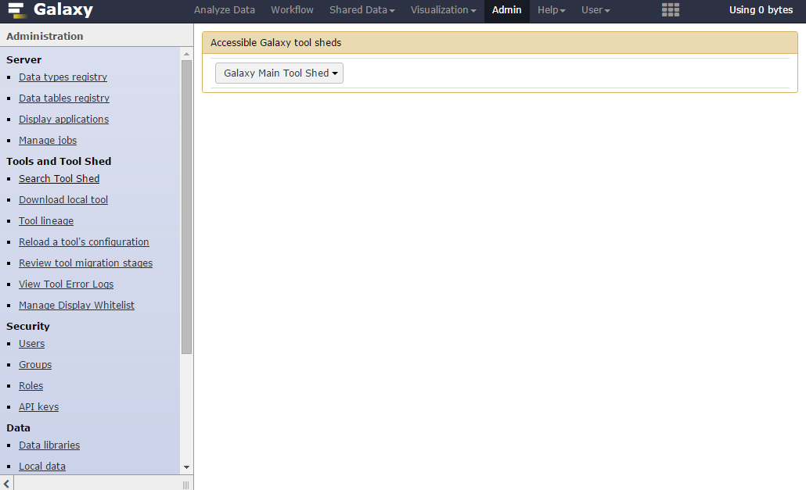
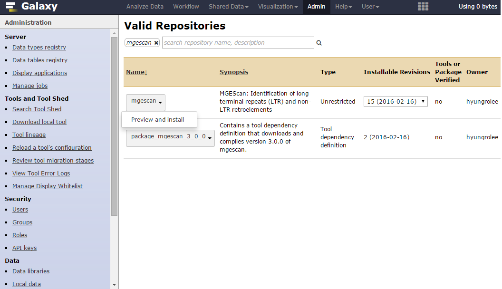
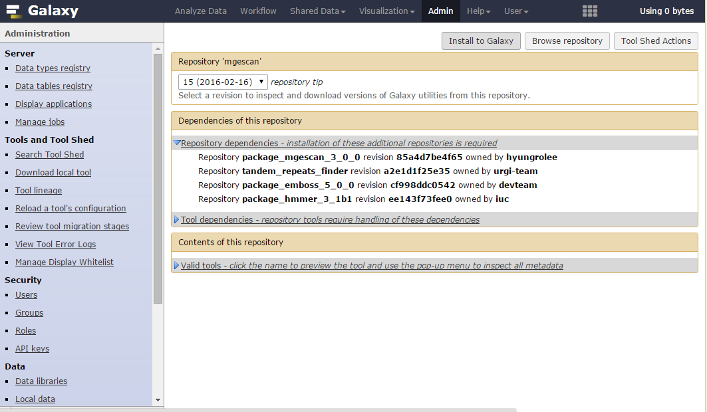
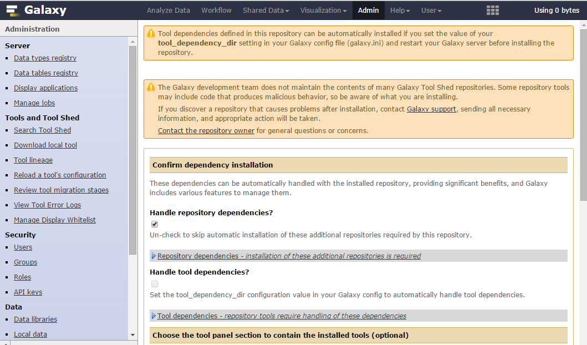
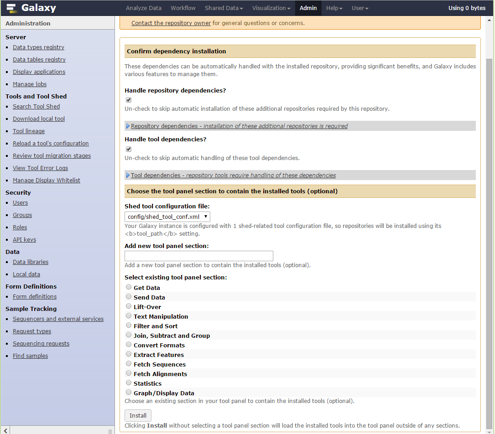
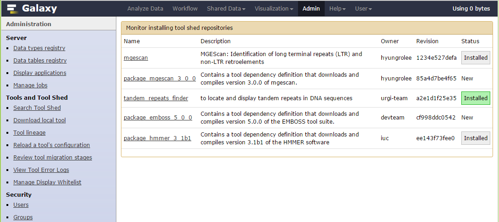
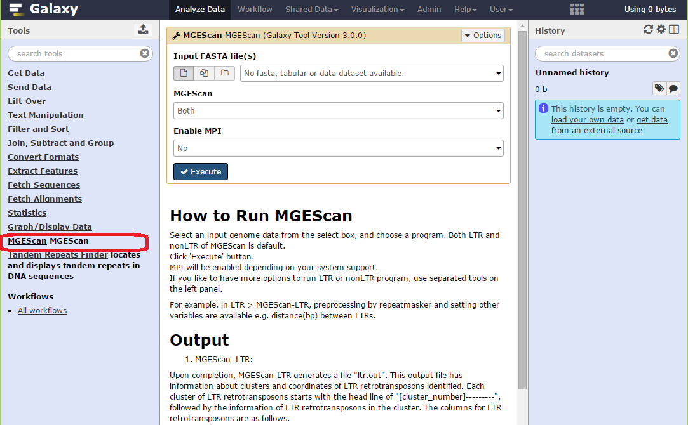

MGEScan ToolShed
===============================================================================

MGEScan is available in Galaxy ToolShed to install MGEScan tools and
dependencies from the public Galaxy Tool Shed (https://toolshed.g2.bx.psu.edu).
A few clicks allow you to install MGEScan and required software easily e.g.
HMMER, Tandem Repeat Finder, and EMBOSS. The following installation guide
explains how to apply MGEScan to your existing or brand new Galaxy server using
ToolShed.

Installation Guide
-------------------------------------------------------------------------------

Prerequite
"""""""""""""""""""""""""""""""""""""""""""""""""""""""""""""""""""""""""""""""

You need to make sure the following system packages are available on your
system prior to install MGEScan.

* Python pip
* Python setuptools
* Python dev package
* MPI for parallel processing (i.e. openmpi-bin, libopenmpi-dev on Ubuntu)

Admin Page
"""""""""""""""""""""""""""""""""""""""""""""""""""""""""""""""""""""""""""""""

Admin user only is able to add a new Galaxy Tool from ToolShed. Find **Admin**
link from the top menu tab. Click **Search Tool Shed** on the left menu tab of
the Admin page.

If you can find 'Galaxy Main Tool Shed' select button on the right page, click
**Browse valid repositories**.  It redirects the page to the public Galaxy
toolshed page in which 3,728 tools available in 2016.

Type ``mgescan`` in the search box. Choose ``mgescan``, not
``package_mgescan_3_0_0`` to preview and install.  

You may find there are other dependencies to be installed as well. If you are
ready to install, find **Install to Galaxy** button on top of the page. It goes
to the confirmation page.

.. note:: You need to make sure `repository dependencies` and `tool
        dependencies` are checked in the page. Otherwise, necessary tools or
        repositories may not be installed properly.

You will find **Install** button at the bottom of the page. Once you click the
button, your Galaxy server starts to download tools and repositories and
install MGEScan on your Galaxy.

You can find MGEScan from **Manage installed tools** page from the left menu
tab in the admin page.  ``mgescan`` tool adds EMBSS, HMMER, Tandem Repeat
Finder and MGEScan packages.  You need to find all these tools are successfully
installed. *Installation Status* indicates whether is is installed properly
with colors. *Installed* with light green box indicates the tool or package
installation is succeeded, if you see grey box, there is some issue in the
installation.

Go to the main page of your Galaxy. The new **MGEScan MGEScan** tool is
available on your left tool menu tab.

