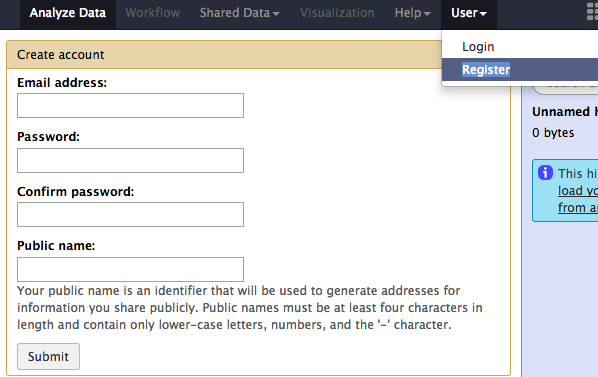
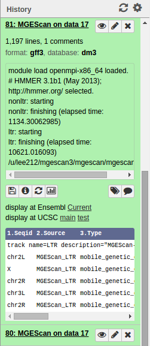

.. _ref-mgescan-tutorial:

QuickStart
===============================================================================

MGEScan, identifying LTR and non-LTR in genome sequences are available on the
Galaxy scientific workflow which is a web-based workflow software to support
data analysis with various tools.

Overview
-------------------------------------------------------------------------------

This tutorial demonstrates a quick start of using MGEScan on Galaxy workflow
with a sample dataset, D. melanogaster genome.

.. tip:: Approximate 3 hours and 30 minutes (including 3 hours computation
         time)

Run MGEScan-LTR and MGEScan-nonLTR for D. melanogaster
-------------------------------------------------------------------------------

In this tutorial, we will try to run both MGEScan-LTR and MGEScan-nonLTR with
D. melanogaster genome dataset. You can find the dataset at the ``Shared Data``
menu on top and MGEScan tools on the left frame.

Access to Galaxy/MGEScan
^^^^^^^^^^^^^^^^^^^^^^^^^^^^^^^^^^^^^^^^^^^^^^^^^^^^^^^^^^^^^^^^^^^^^^^^^^^^^^^

Run Galaxy/MGEScan at your machine:

.. * http://silo.cs.indiana.edu:38080

Login or Register (Optional)
^^^^^^^^^^^^^^^^^^^^^^^^^^^^^^^^^^^^^^^^^^^^^^^^^^^^^^^^^^^^^^^^^^^^^^^^^^^^^^^

You can save your work if you have account on Galaxy workflow. The user-based
history in Galaxy/MGEScan stores your data and launched tasks. The guest user
account is able to run the MGEScan tools without the login but results or
history data won't be saved if the web browser session is closed.

Register
"""""""""""""""""""""""""""""""""""""""""""""""""""""""""""""""""""""""""""""""

Email address is required to sign up.

.. * http://silo.cs.indiana.edu:38080/user/create

Login
"""""""""""""""""""""""""""""""""""""""""""""""""""""""""""""""""""""""""""""""

If you already have an account, you can use your user id and password at
the *User > Login* page.

.. * http://silo.cs.indiana.edu:38080/user/login

Get Dataset from ``Shared Data``
^^^^^^^^^^^^^^^^^^^^^^^^^^^^^^^^^^^^^^^^^^^^^^^^^^^^^^^^^^^^^^^^^^^^^^^^^^^^^^^

You can find sample datasets (e.g. D.melanogaster) at ``Shared Data`` menu on
top. Click "Shared Data" > "Data Libraries" and find "Sample datasets for
MGEScan".

.. * http://silo.cs.indiana.edu:38080/library/index

Example: Drosophila melanogaster
^^^^^^^^^^^^^^^^^^^^^^^^^^^^^^^^^^^^^^^^^^^^^^^^^^^^^^^^^^^^^^^^^^^^^^^^^^^^^^^

In the Data Library, enable the checkbox for ``d.melanogaster`` and click
"Select datasets for import into selected histories" from the down arrow at
the end.

You will find 8 fasta files are available. We need to import all of them, make
them all checked and click "Import library datasets" in the middle of the page.

Once you imported the D. melanogaster datasets into your history, you are ready
to run MGEScan tools on Galaxy. Go to the main page, and checkout imported
datasets (8 files) on the right frame of the page.

.. note:: You can select where datasets to be imported.

.. comment::

        Get Data (Upload input data)
        ^^^^^^^^^^^^^^^^^^^^^^^^^^^^^^^^^^^^^^^^^^^^^^^^^^^^^^^^^^^^^^^^^^^^^^^^^^^^^^^

        With a couple of options to upload your genome sequences, MGEScan is ready to
        conduct data analysis.

        Upload file from local (Option I)
        """""""""""""""""""""""""""""""""""""""""""""""""""""""""""""""""""""""""""""""

        Single file upload from local is available at *Get Data > Upload File*.

        .. image:: images/rtm-upload-file.png

        Get Data from UCSC Table Browser (Option II)
        """""""""""""""""""""""""""""""""""""""""""""""""""""""""""""""""""""""""""""""

        You can also use UCSC to get input data instead of uploading files from local.
        UCSC Table Browser provides the easy way to download the database to Galaxy.
        Open "Get Data > UCSC Main".

        `Using UCSC Table Browser <http://genome.ucsc.edu/cgi-bin/hgTables?GALAXY_URL=http%3A//silo.cs.indiana.edu%3A38080/tool_runner&tool_id=ucsc_table_direct1&hgta_compressType=none&sendToGalaxy=1&hgta_outputType=bed#Help>`_

        .. image:: images/rtm-upload-ucsc.png

Run MGEScan for LTR and nonLTR
^^^^^^^^^^^^^^^^^^^^^^^^^^^^^^^^^^^^^^^^^^^^^^^^^^^^^^^^^^^^^^^^^^^^^^^^^^^^^^^

In the new version of MGEScan, two programs, MGEScan-LTR and MGEScan-nonLTR,
can be ran at the same time with a merged result. Open the page at **"MGEScan >
MGEScan"**, a simple tool is available for LTR and nonLTR executions with MPI
option for parallel processing. 

.. note:: Find **LTR** or **nonLTR** page if you'd like to choose other options
          to run MGEScan tools in detail.

Create a single link to multiple inputs
^^^^^^^^^^^^^^^^^^^^^^^^^^^^^^^^^^^^^^^^^^^^^^^^^^^^^^^^^^^^^^^^^^^^^^^^^^^^^^^

In the example of ``d. melanogaster``, we have 8 fasta files as its sequences.
To analyze them all at the same time, we create a single link to the files
prior to running MGEScan tool on Galaxy. One archive file to many files (e.g.
file.tar) will be used as an input of MGEScan tool on Galaxy. Note that Galaxy
workflow does not support multiple arbitrary inputs but this symlink tool
allows you to have dynamic inputs as a Galaxy input dataset.

* FInd "Tools > Create a symlink to multiple datasets" on the left frame.

We will add 8 fasta files each by clicking "Add new Dataset" from "8:
Drosophila_melanogaster.BDGP6.dna.chromosome.dmel_mitochondrion_genome.fa" to
"1: Drosophila_melanogaster.BDGP6.dna.chromosome.2L.fa" like so:

.. image:: images/galaxy-create-a-symlink.png

Make sure you have added all the files without duplication. The added order is
not important though. File(s) will be placed in a same directory without
order.

MGEScan Tool
^^^^^^^^^^^^^^^^^^^^^^^^^^^^^^^^^^^^^^^^^^^^^^^^^^^^^^^^^^^^^^^^^^^^^^^^^^^^^^^

MGEScan runs both LTR and nonLTR with a selected input genome sequence.
Find "MGEScan > MGEScan" tool on the left frame and confirm that the symlink
dataset we created in the previous step is loaded in "From" select form like so:

Enable MPI
"""""""""""""""""""""""""""""""""""""""""""""""""""""""""""""""""""""""""""""""

To accelerate processing time, select "Yes" at "Enable MPI" select form and
specify "Number of MPI Processes". If you have a multi-core system, use up to
the number of cores. 

.. silo.cs.indiana.edu has 24 cores but we will use **4** in this tutorial to avoid being a noisy neighbor.

Our options are:

* From: Create a symlink to multiple datasets on data 2 and data 8, and others
* MGEScan: Both
* Enable MPI: Yes
* Number of MPI Processes: 4

And click "Execute".

.. comment::

   .. image:: images/rtm-mgescan.png

        LTR
        ^^^^^^^^^^^^^^^^^^^^^^^^^^^^^^^^^^^^^^^^^^^^^^^^^^^^^^^^^^^^^^^^^^^^^^^^^^^^^^^

        LTR takes option values from user input. RepeatMasker or scaffold files can be
        selected in this tool. 

        .. image:: images/rtm-ltr.png

        nonLTR
        ^^^^^^^^^^^^^^^^^^^^^^^^^^^^^^^^^^^^^^^^^^^^^^^^^^^^^^^^^^^^^^^^^^^^^^^^^^^^^^^

        nonLTR

        .. image:: images/rtm-nonltr.png

Computation Time
-------------------------------------------------------------------------------

Our test case took 3 hours for analyzing LTR and nonLTR of ``D. melanogaster``:

* nonLTR: 19 minutes
* LTR: 3 hours
* Total: 3 hours

Results
-------------------------------------------------------------------------------

Upon the MGEScan tools completion, the output files are accessible via Galaxy
in `gff3` format, a plain text, or an archived (e.g. tar.gz) file.  You will
notice that the color of your tools has been changed to green like so:

You can download the output files to your local storage, or get access to
Genome Browser with provided links.

Visualization: UCSC or Ensembl Genome Browser
^^^^^^^^^^^^^^^^^^^^^^^^^^^^^^^^^^^^^^^^^^^^^^^^^^^^^^^^^^^^^^^^^^^^^^^^^^^^^^^

Your genomic data in a Generic Feature Format Version 3 (gff3) can be displayed
by a well known visualization tool such as UCSC or Ensembl Genome Browser on
Galaxy with custom annotations of MGEScan for LTR and nonLTR.  Find the link
provided for gff3 to view interactive graphical display of genome sequence
data.

.. image:: images/mgescan-genome-browser.png

UCSC Genome Browser (Example View)
"""""""""""""""""""""""""""""""""""""""""""""""""""""""""""""""""""""""""""""""

.. image:: images/mgescan-ltr-gff3-ucsc-browser.png

Ensembl (Example View)
"""""""""""""""""""""""""""""""""""""""""""""""""""""""""""""""""""""""""""""""

Additional Options
^^^^^^^^^^^^^^^^^^^^^^^^^^^^^^^^^^^^^^^^^^^^^^^^^^^^^^^^^^^^^^^^^^^^^^^^^^^^^^^

There are other options to view results on a web interface or local.

* View data: Content of the result file

.. image:: images/galaxy-view-data.png

* Download: Download the file

Description of tools
"""""""""""""""""""""""""""""""""""""""""""""""""""""""""""""""""""""""""""""""

Each tool in Galaxy has its description to explain how to use.

