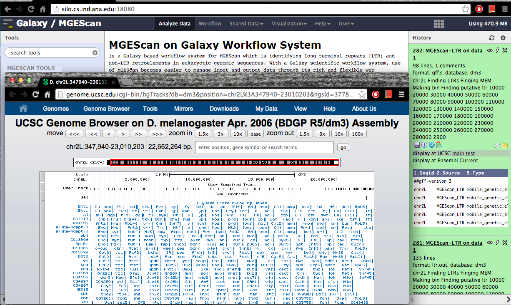

Visualization
=============

Galaxy Workflow System helps display results using genome browsers such as UCSC or Ensembl. MGEScan supports General Feature Format (GFF) to describe genes of MGEScan results so both ltr and non-ltr results can be views via UCSC Genome Browser or Ensembl.

UCSC Genome Browser
-------------------

.. comment:

 Ensembl
 -------

 .. image:: images/mgescan-ltr-gff3-ensembl.png

Source Code
-----------
In MGEScan source code, ltr/toGFF.py and nonltr/toGFF.py are used to convert results to GFF format developed by Wazim Mohammmed Ismail.
