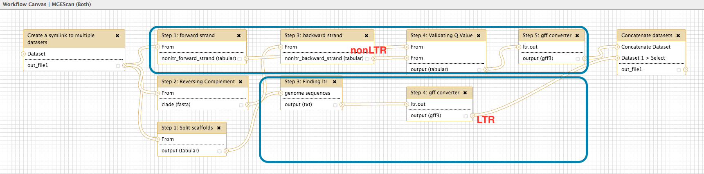

.. _ref-mgescan-workflow:

MGEScan Workflow
===============================================================================

MGEScan tools for LTR and nonLTR consist of a series of computational steps in
Galaxy Workflow.  With the drawing canvas, you can compose sub-processes of
MGEScan with other Galaxy tools and run entire workflow applications (steps) or
just find out the details of processes of MGEScan tools.  Each application 
normally has both input and output connected to the input of the next.

We provide three workflows:

* MGEScan (Both) for identifying LTR and nonLTR
* MGEScan-LTR
* MGEScan-nonLTR

MGEScan (Both)
-------------------------------------------------------------------------------

This workflow contains 10 steps to run both LTR and nonLTR programs in parallel.
Find "MGEScan (Both)" at Workflow menu on top.

MGEScan-LTR
-------------------------------------------------------------------------------

This workflow contains 3 steps to run the LTR program.

* Step 1: Split scaffolds
* Step 2: RepeatMasker (optional)
* Step 3: Finding ltr
* Step 4: gff converter

MGEScan-nonLTR
-------------------------------------------------------------------------------

This workflow contains 6 steps to run the nonLTR program.

* Create a symlink to multiple datasets
* Step 1: forward strand
* Step 2: Reversing Complement
* Step 3: backward strand
* Step 4: Validating Q Value
* Step 5: gff converter

Workflow Canvas
-------------------------------------------------------------------------------

In Galaxy > Workflow > Edit, you can modify or update the MGEScan workflow on
Galaxy Workflow Canvas.

Registered Workflow in Local 
-------------------------------------------------------------------------------

Once you completed composing/updating workflow, you can save your work on
local. You can download and store workflow file on your storage.

.. image:: images/mgescan-private-workflow.png

Registered Workflow in Public Server (usegalaxy.org)
-------------------------------------------------------------------------------

Through Galaxy Public Workflow Website, your workflow can be shared with other
scientists and researchers. MGEScan workflow has been registed on
https://usegalaxy.org/workflow/list_published.

Overview of MGEScan Workflow (Draft)
-------------------------------------------------------------------------------

The published MGEScan workflow consists of LTR and non-LTR programs in
parallel. LTR has four components including splitting scaffolds, pre-processing
by repeatmasker, finding LTRs, and converting results in gff3 format.

:ref:`Quick Start <ref-mgescan-tutorial>`
